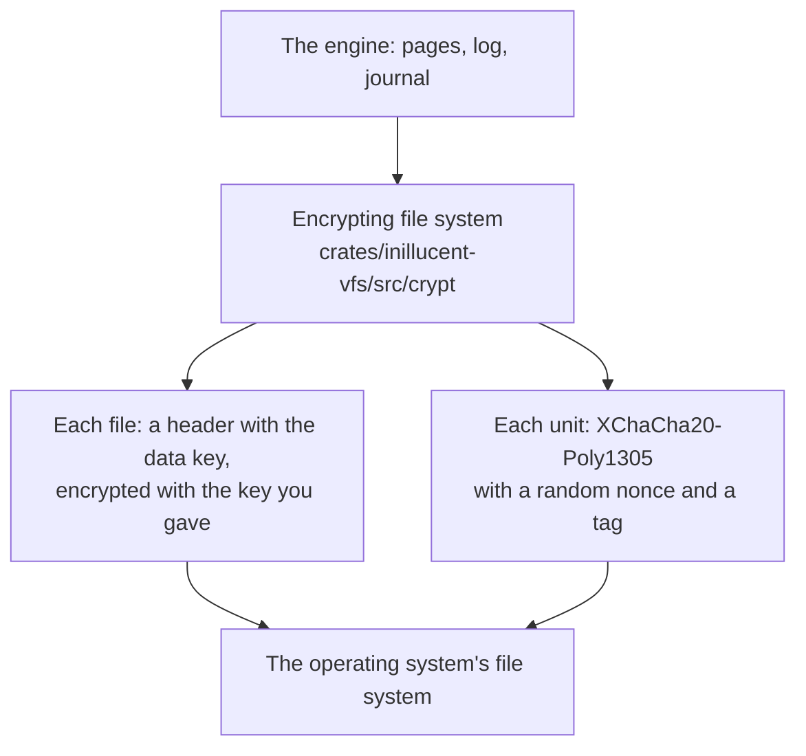

# Encryption at rest

A database opened with a key is encrypted on the disk. The database file, its log and its journals
hold ciphertext, and a byte changed by somebody without the key is found on the next read. This
page shows how to create and open an encrypted database, how to give the key to each program and
driver, what is encrypted, and what it costs.

## Terms used on this page

| Term | What it means |
|---|---|
| **Key** | What an encrypted database is opened with. Either a passphrase or a raw key |
| **Passphrase** | Any text. PBKDF2-HMAC-SHA256 turns it into a 32 byte key with 600,000 rounds of work |
| **Raw key** | 32 bytes written as `x'` followed by 64 hex digits and `'`, the form SQLCipher uses. It is used as it is, with no PBKDF2 |
| **Data key** | A random 32 byte key made when the database is created. It encrypts every page. It is stored in each file's header, encrypted with the key you give |
| **XChaCha20-Poly1305** | The cipher. It encrypts a block of data and adds a 16 byte tag that fails when any byte of the block or the tag has changed |
| **Unit** | The block of plaintext encrypted together. In the database file a unit is one page |
| **Rekey** | Changing the key a database is encrypted with |

Other terms are in [the glossary](glossary.md).

## Create and open an encrypted database

```sh
printf '%s' 'correct horse battery staple' > app.key
inillucent --key-file app.key create app.rdb
inillucent --db app.rdb --key-file app.key exec "CREATE TABLE note (body TEXT)"
inillucent --db app.rdb --key-file app.key exec "INSERT INTO note VALUES ('the vault code is 7461')"
inillucent --db app.rdb --key-file app.key query "SELECT * FROM note"
inillucent --db app.rdb --key-file app.key query "PRAGMA encryption"    # xchacha20-poly1305
inillucent --db app.rdb query "SELECT * FROM note"                      # fails: no key
```

A database created with a key is encrypted. Every later open needs the same key. The last command
fails with exit code 1 and the status `corrupt`:

```
Error [corrupt]: this database is encrypted. Open it with its key: --key-file, the INILLUCENT_KEY environment variable, or a driver's key option
```

## Giving the key

The command line, the shell and the MCP server take the key from a file or from the environment.
None of them takes the key as a word on the command line, because every user of the machine can
read a command line in the process list, and a shell saves it in its history.

| Where the key comes from | How |
|---|---|
| a file | `--key-file app.key` on `inillucent` and `inillucent-mcp`, and `-key-file app.key` on `inillucent-shell`. The file holds the key. A line end at its end is not part of the key |
| the environment | `INILLUCENT_KEY` holds the key, or `INILLUCENT_KEY_FILE` names a file that holds it |

`--key-file` wins over `INILLUCENT_KEY_FILE`, which wins over `INILLUCENT_KEY`. Once a program has a
key, every database it opens is opened with that key.

| Program or library | How a key is given |
|---|---|
| Rust driver | `OpenOptions { key: Some(EncryptionKey::parse("...")), ..OpenOptions::default() }` |
| Rust engine | `Database::open_encrypted(path, EncryptionKey::passphrase("..."))` |
| C | `inillucent_open_with_key(path, flags, key, &db, &error)`. The key is a UTF-8 string |
| Python over the C library | `inillucent.Database(path, key="...")` |
| npm, Go, PHP and Python packages | a `key` option, passed to the command line in `INILLUCENT_KEY` |
| MCP | `inillucent-mcp --db app.rdb --key-file app.key`. No tool takes a key |

`EncryptionKey::parse` reads `x'<64 hex digits>'` as a raw key and anything else as a passphrase.
[`drivers/README.md`](../drivers/README.md) and each package's readme show the key option in
context.

## Encrypt or decrypt a database you already have

```sh
inillucent --db plain.rdb --key-file app.key encrypt sealed.rdb    # an encrypted copy
inillucent --db sealed.rdb --key-file app.key decrypt opened.rdb   # a plaintext copy
```

| Command | What it does |
|---|---|
| `inillucent encrypt <file>` | reads the plaintext database `--db` names, without a key, and writes an encrypted copy with the key |
| `inillucent decrypt <file>` | reads the encrypted database with the key and writes a plaintext copy |

Both copy every table, index, view and trigger the way `VACUUM INTO` does, and both refuse a path
that already holds a file. The source is left as it was. Replace it with the copy once the copy
opens. The Rust driver's `Database::export_to(path, key)` does the same from a program.

A database cannot be encrypted or decrypted in place. `PRAGMA rekey = ''` is refused and names
`inillucent decrypt`.

`inillucent migrate` writes a plaintext database, with or without a key. To end with an encrypted
one, migrate, then run `inillucent encrypt` on the result and remove the plaintext file.

## Change the key

```sh
printf '%s' 'a new passphrase' > new.key
inillucent --db app.rdb --key-file app.key rekey --new-key-file new.key
```

`PRAGMA rekey = 'a new passphrase'` does the same from SQL. `inillucent rekey` reads the new key from
`--new-key-file` or from `INILLUCENT_NEW_KEY`.

A rekey checkpoints the database, then rewrites the header of the database file and of each log
segment and journal beside it. The data key does not change, so no page is rewritten, and a rekey
takes the same time whatever the size of the database. The old key stops opening the database when
the command returns.

Each header is kept in two copies. A rekey writes one copy and syncs it, then writes the other
copy and syncs it, so a crash during a rekey leaves a file that one of the two keys opens.

## Attach an encrypted database

```sql
ATTACH 'other.rdb' AS other KEY 'the other passphrase';
ATTACH 'same.rdb' AS same;                      -- the connection's own key
ATTACH 'plain.rdb' AS plain KEY '';             -- a plaintext file
ATTACH 'raw.rdb' AS raw KEY "x'2dd29ca851e7b56e4697b0e1f08507293d761a05ce4d1b628663f411a8086d99'";
```

These are SQLCipher's rules. With no `KEY` clause, an attachment is opened with the key of the
connection, which is no key for a plaintext connection.

## The pragmas

| Pragma | What it does |
|---|---|
| `PRAGMA encryption` | answers `xchacha20-poly1305` for an encrypted database and `none` otherwise. It cannot be set |
| `PRAGMA rekey = 'new key'` | changes the key of an encrypted database. It fails inside a transaction and on a read only connection |
| `PRAGMA key = '...'` | refused. In SQLCipher it is the first statement of a connection. Here the key is given when the database is opened, because opening reads the file |

`inillucent capabilities` lists `encryption` and `attach_with_key` as `yes`.

## What is encrypted

| File | Encrypted | How |
|---|---|---|
| the database file | yes | one unit per page, with a 64 byte trailer in a 512 byte sector of its own after each page |
| each log segment, `<database>-wal.NNNNNNNNNN` | yes | units of 4,032 bytes, each kept in two slots of 4,096 bytes |
| the rollback journal, `<database>-journal` | yes | the same as a log segment |
| sort and spill files | yes | a key made for the process and never stored |
| a `VACUUM`, `VACUUM INTO` or `backup` copy | yes, with the same key | |
| the super journal of a transaction across several files | no | it holds file names and no rows. SQLCipher leaves it in plaintext too |

The tests read every file beside an encrypted database with the operating system's own calls and
look for the rows that were written. `crates/inillucent-compat/tests/engine/encryption_at_rest.rs`
does it through the Rust engine, `crates/inillucent-compat/tests/e2e/cli_commands.rs` through the
command line and the shell, and `crates/inillucent-compat/tests/e2e/mcp_session.rs` through MCP.

## Errors

| What happened | Exit code | Status | Message |
|---|---|---|---|
| an encrypted database opened without a key | 1 | `corrupt` | `this database is encrypted. Open it with its key: ...` |
| a plaintext database opened with a key | 1 | `corrupt` | `this database is not encrypted, so it cannot be opened with a key. ...` |
| the wrong key | 1 | `corrupt` | `file is not a database, or the key is wrong` |
| a page changed by somebody without the key | 1 | `corrupt` | the page fails its checksum, as a damaged page does |

`corrupt` is the status SQLite and SQLCipher give a file they cannot read as a database, so a
binding that already handles it needs no change. Over the C library the status is
`INILLUCENT_CORRUPT`.

## How it works



`inillucent-vfs` is the only crate that touches a file. The encrypting file system wraps the
operating system's file system, so every file the engine opens goes through it, and no crate above
it changes how it reads or writes. The engine sees plaintext at the offsets it wrote.

1. **One data key per database.** It is random, made when the database is created, and stored in
   the header of each file, encrypted with a key made from your key. A wrong key fails one tag
   check on the header before any page is read.
2. **Units.** Each unit is encrypted with its own nonce, and its tag covers the file it belongs to,
   its position in the file and its length. A unit copied to another place fails its tag.
3. **Torn writes.** A crash can leave a unit half written. A unit that fails its tag reads as
   random bytes, which fail the page checksum, so recovery treats it as the torn page it usually
   is and rebuilds it from the log. The log and the journal keep two copies of each unit and
   rewrite them in turn, so a crash in the middle of an append never destroys a record an earlier
   commit made durable.
4. **Crash tests.** `crates/inillucent-compat/tests/durability/encrypted_crash.rs` cuts the power at
   every step of a commit and of a checkpoint on a simulated disk that tears and garbles unsynced
   sectors, in `delete` and `wal` mode, and checks that every cut recovers to the old state or the
   new one, and that an acknowledged commit is never lost.

The design, and why the page format did not change, is in
[`tasks/task-2142-encryption-at-rest-tdd.md`](../tasks/task-2142-encryption-at-rest-tdd.md).

The cryptography is written in this repository and checked against the published test vectors of
each standard. [The dependency policy](dependency-policy.md#code-that-is-first-party-on-purpose)
says why.

## What it costs

Measured on 2026-09-28 with the release build of the command line on the Windows development
machine. Each number is one run of the whole program, twice, plaintext and encrypted in turn, with
a raw key. Another agent's work was running on the machine, so read them as sizes, not as exact
figures.

| Workload | Plaintext | Encrypted |
|---|---:|---:|
| insert 100,000 rows of 100 bytes in one statement | 499 ms, 498 ms | 806 ms, 733 ms |
| read every row, `SELECT sum(length(b))` | 72 ms, 71 ms | 101 ms, 94 ms |
| 20,000 reads by key in one query | 120 ms, 91 ms | 129 ms, 109 ms |
| 1,000 commits of one row each through the shell | 1,521 ms, 1,383 ms | 1,574 ms, 1,559 ms |
| `SELECT 1`, which is mostly opening the file | 47 to 53 ms | 54 to 63 ms with a raw key, 260 to 309 ms with a passphrase |
| the database file after the insert | 11,468,800 bytes | 11,656,192 bytes |

The file is 1.6% larger, which is the trailer sector after each 32 KiB page. A log segment and a
journal take a little over twice their plaintext size on the disk while they exist, because of
their two slots. A checkpoint removes the log it has folded.

A passphrase costs about 200 ms each time a database is opened, which is PBKDF2 doing its job. A
raw key from a key manager has no such cost.

## What it does not protect

- **Putting back an older copy.** Somebody who can write the file can replace a unit, or the whole
  file, with an older copy of itself. The old unit is genuine, so its tag passes. SQLCipher and
  Turso have the same limit.
- **Sizes and write patterns.** The size of each file, how many log segments there are, and which
  units changed between two copies of the file can be seen without the key.
- **The key in memory.** The key is in the process's memory while a database is open. It is
  overwritten with zeros when the database closes, but a swap file or a crash dump can hold it.
- **Guessing a weak passphrase.** PBKDF2 slows each guess down. It is the weakest of the password
  functions OWASP lists against a graphics card. A long passphrase, or a raw key, avoids the
  question.
- **The super journal.** It is written in plaintext and holds file names.

## Where to go next

- [SQL support](sql.md) for `ATTACH` and the pragmas.
- [Architecture in one page](architecture-overview.md) for where the encrypting file system sits.
- [`drivers/README.md`](../drivers/README.md) for the key option in each language.
