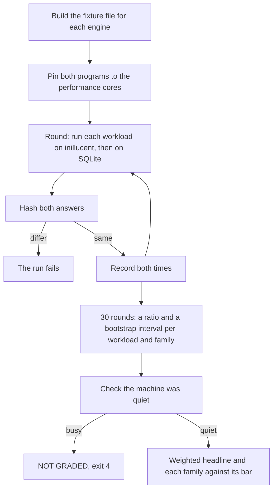

# Performance against SQLite

This page gives inillucent's current speed next to SQLite 3.53.4, in two measurements: the engine
on its own, and inillucent called the way programs call it (one process per command, a script
piped into the shell, the Python driver and the npm package). It then gives processor time, memory
and file size, and the method. Every earlier measurement, including each hill climb, is in
[Performance history](performance-history.md). [Feature comparison](feature-comparison.md)
compares what each engine can do.

## Summary

| Measurement | Against SQLite 3.53.4 |
|---|---|
| **The engine**, weighted over ten families of work, 100,000 rows | **484% faster** |
| **Processor time**, one round of the engine plan | **79% less** |
| **Peak resident memory**, one round of the engine plan | **14% more** |
| **Database file**, the same imported data | **3.6% larger** |
| **Called the way programs call it**, all 25 workloads | **64% faster** |
| the Python driver, against Python's `sqlite3` module, 9 workloads | **136% faster** |
| the npm package, against Node's `node:sqlite`, 2 workloads | **207% faster** |
| SQL scripts piped into the shell, against the `sqlite3` shell, 6 workloads | **46% faster** |
| the command line, one process per command, against the `sqlite3` shell, 8 workloads | **3% faster** |

The two measurements answer different questions. The engine figure times statements inside one
process, so it is what an application that keeps a database open sees. The second figure includes
everything a caller pays around the engine: starting a program, crossing from Python or Node into
the C library, and building each language's own values. Starting a program costs about the same
for both engines and is most of a short command, which is why the command line is close to SQLite
while the engine is several times faster.

Each figure is a geometric mean over its workloads, so one very fast workload cannot carry the
result.

| | Engine measurement | Measurement of how programs call it |
|---|---|---|
| **Program** | `inillucent-fullgate` | the usage benchmark (Node, Python and the programs themselves) |
| **Build** | `main` at `573609d4`, released as 2.3.0, built with `cargo build --release` | the 2.3.0 release build, profile guided as `packaging/release-all.ps1` makes it |
| **Data** | the medium fixture, 100,000 rows | a table of 10,000 rows with two indexes |
| **Rounds** | three runs of 30 paired rounds; the median run | 15 rounds, each workload once per engine per round, in rotating order |
| **Settings** | `synchronous = FULL`, a 128 MiB page cache on both engines, no plan cache | each engine's own defaults |
| **Date** | 7 October 2026 | 6 October 2026 |
| **Answers checked** | every workload's answer hashed and compared with SQLite's: all 34 agreed on every round of all three runs | not compared |
| **Machine** | Windows 11 on x64, Intel Core Ultra 9 285. Both engines pinned to the same eight performance cores | the same machine, not pinned |

**The engine runs were not graded.** The gate compares SQLite's own speed with a reference recorded
on this machine when it was idle, and grades a run only when SQLite is within 3% of it. In all three
runs SQLite was 6.8% to 7.3% slower than the reference, with only a web browser and Task Manager
running beside it. A busy machine slows SQLite more than inillucent, so the 484% reads somewhat high.
The last graded run, on 26 September 2026 with release 1.0.32, measured 419% faster; it is in
[Performance history](performance-history.md#the-graded-gate-run-of-26-september-2026).

## By family

`weight` is the family's share of the engine headline. `bar` is what the performance contract
(`compat/perf/contract.toml`) asks of the family. The ratio column is SQLite's time divided by
inillucent's, which is how the contract states its bars; 2.00x is 100% faster.

| family | weight | what it measures | result | ratio | bar |
|---|---|---|---|---:|---|
| `read.point` | 16% | one row by rowid, by integer key, and through a secondary index | **3,234% faster** | 33.34x | 100% faster (2.00x), met |
| `large.values` | 4% | text and blobs across the size where a value stops fitting in a leaf | **1,129% faster** | 12.29x | 50% faster (1.50x), met |
| `read.analytical` | 10% | scans, aggregates, `GROUP BY`, `DISTINCT`, sorts | **1,043% faster** | 11.43x | 400% faster (5.00x), met |
| `read.range` | 12% | selective ranges, forward and reverse, covering and not | **493% faster** | 5.93x | 200% faster (3.00x), met |
| `read.join` | 8% | two table and four table joins | **426% faster** | 5.26x | 200% faster (3.00x), met |
| `write` | 20% | insert, update, delete, upsert, with and without indexes | **318% faster** | 4.18x | 50% faster (1.50x), met |
| `transaction` | 10% | autocommit, small batches, large batches, savepoints | **153% faster** | 2.53x | as fast (1.00x), met |
| `extension` | 8% | JSON, FTS5, R-Tree | **147% faster** | 2.47x | 50% faster (1.50x), met |
| `open.prepare` | 8% | parse, bind, step one row, reset | **102% faster** | 2.02x | 400% faster (5.00x), missed |
| `schema` | 4% | `CREATE INDEX` and its backfill | **47% faster** | 1.47x | 200% faster (3.00x), missed |

No family is slower than SQLite. Every family that misses its bar misses it the same way it did on
26 September, by less: `open.prepare` went from 65% faster to 102% faster and `schema` from 27% to
47% faster.

## The workloads that are slower

Thirty workloads count toward the engine headline. Twenty eight are faster than SQLite. One is level
with it and one is slower:

| workload | family | result | ratio | why |
|---|---|---|---:|---|
| `prepare.trivial` | `open.prepare` | **72% slower** | 0.58x | `SELECT 1` is compiled on every call. The bound result columns, the column name, the boxed statement, the expression tree and the output names are built each time, where SQLite's compile of the same statement allocates less |
| `txn.autocommit` | `transaction` | **level**, 2% slower to 0% across the three runs | 1.00x | one `fsync` a commit on each engine. On this disk an `fsync` is most of the millisecond a statement takes |

`join.range` (2% faster, 1.02x), `extension.fts.build` (14% faster, 1.14x) and `extension.json`
(131% faster, 2.31x), all slower than SQLite on 26 September, are now faster. `schema.index`, the one
workload of the `schema` family, is 48% faster (1.48x). The four correlated subquery workloads, which
the contract does not weight, are all faster: `correlated.exists` 194%, `correlated.in` 30%,
`correlated.exists.selective` 98% and `correlated.scalar.selective` 63%.

The fastest workloads: `scan.aggregate` 5,369% faster, `point.miss` 5,233%, `large.read` 4,379%,
`point.rowid` 3,144%, `scan.group` 2,727%, `join.selective` 2,588%, `point.index` 1,946% and
`range.reverse` 1,749%.

## Memory

**Peak resident memory is 43.37 MiB against SQLite's 38.04 MiB, 14% more.** The contract asks for 5%
less, so this bar is missed. Processor time for one round of the whole plan is 234 ms against
SQLite's 1,125 ms, 79% less, where the contract asks for 60% less.

Each figure comes from one child process per engine that opens a finished file and runs one round
of the plan. Most of the memory difference is the cost of a Rust process on this machine before the
engine starts, and the index build's sort in `schema.index` sets the peak.
[Memory on 26 September 2026](performance-history.md#memory) has the breakdown by workload.

## How programs call it

The engine figure times statements inside one process. This section times what a program does
around them: start the `inillucent` program once per command, pipe a SQL script into
`inillucent-shell`, call the Python driver, or call the npm package. Each is compared with the
same use of SQLite: the `sqlite3` 3.53.4 shell, Python's `sqlite3` module and Node's `node:sqlite`.
Each engine runs with its own default settings, because the defaults are what this kind of use gets.

| How it was called | Workloads | Against SQLite |
|---|---:|---|
| the Python driver | 9 | **136% faster** |
| the npm package | 2 | **207% faster** |
| SQL scripts piped into the shell | 6 | **46% faster** |
| the command line, one process per command | 8 | **3% faster** |
| all 25 | 25 | **64% faster** |

### Python and Node

| Workload | inillucent | SQLite | Result |
|---|---:|---:|---|
| Python, 5,000 lookups by key | 21.50 ms | 96.16 ms | **347% faster** |
| Python, 200 `GROUP BY` queries | 94.29 ms | 522 ms | **453% faster** |
| Python, 1,000 single row updates | 1,243 ms | 6,284 ms | **405% faster** |
| Python, 100 single row inserts | 124 ms | 456 ms | **268% faster** |
| Python, 200 range queries of 200 rows | 18.86 ms | 41.72 ms | **121% faster** |
| Python, read 10,000 rows | 5.88 ms | 7.88 ms | **34% faster** |
| Python, a 10,000 row table and two indexes | 37.35 ms | 46.66 ms | **25% faster** |
| Python, 10,000 inserts in a transaction into a table with two indexes | 24.30 ms | 30.34 ms | **25% faster** |
| Python, 100 opens and closes | 6.82 ms | 7.17 ms | **5% faster** |
| Node, a lookup by key through a session | 0.004 ms | 0.014 ms | **237% faster** |
| Node, a lookup by key with `query()` | 0.034 ms | 0.096 ms | **181% faster** |

### The shell and the command line

| Workload | inillucent | SQLite | Result |
|---|---:|---:|---|
| shell, 200 single row inserts, each its own transaction | 270 ms | 868 ms | **222% faster** |
| shell, 1,000 lookups by key in a script | 26.99 ms | 42.89 ms | **59% faster** |
| shell, a 10,000 row table and two indexes | 52.25 ms | 70.90 ms | **36% faster** |
| shell, `.import --csv` of 50,000 rows | 57.66 ms | 69.19 ms | **20% faster** |
| shell, one `INSERT` of 20,000 rows | 40.68 ms | 44.26 ms | **9% faster** |
| shell, 10,000 `INSERT` statements in a transaction | 39.67 ms | 42.52 ms | **7% faster** |
| command line, `dump` | 30.74 ms | 36.22 ms | **18% faster** |
| command line, `exec` of a one row `INSERT` | 22.79 ms | 24.26 ms | **6% faster** |
| command line, `tables` | 18.67 ms | 19.09 ms | **2% faster** |
| command line, `query` of one row as JSON | 19.23 ms | 19.19 ms | level |
| command line, `query` of one row as text | 18.58 ms | 18.40 ms | 1% slower |
| command line, `query` of 100 rows by an index, sorted, as JSON | 19.50 ms | 19.33 ms | 1% slower |
| command line, `query` of `count(*)` and `max` over 10,000 rows | 18.93 ms | 18.82 ms | 1% slower |
| command line, `--version` | 17.20 ms | 17.00 ms | 1% slower |

### Where the time goes, and why SQLite does not pay the same

**Starting a program.** SQLite pays this too. An empty program takes 13 to 17 ms to start from the
benchmark and 5.7 ms from a terminal, and a one row query takes 7.5 ms (inillucent) and 7.95 ms
(SQLite) from a terminal. About three quarters of every command line call is the operating system
starting the process, for both engines, so no engine can be several times faster than another at
it. The benchmark starts each program with Node's `windowsHide` option, which gives every program a
hidden console of its own and adds about 11 ms to every start. Measured from a terminal instead,
the command line group is 4% faster than SQLite and the shell group 56% faster.

**Writing a row.** 10,000 inserts from Python into a table with no index take 14.2 ms in inillucent
and 12.2 ms in SQLite, so the remaining cost is in writing a row into the table, before any index.
inillucent's leaf page is 32 KiB and holds its rows column by column, with a small area at the end
for rows added since the page was last packed. When that area fills, the whole page is decoded and
encoded again, several times before the page fills and splits. In a profile of the Python insert
into the table with two indexes, writing rows into the trees is 61% of the time, a third of that is
those rewrites, and memory allocation is another 10%. SQLite's leaf page is 4 KiB and holds whole
rows behind a list of offsets. Adding a row copies that row in and moves a few bytes of the list; it
never encodes the rest of the page again.

**Reading many rows into Python.** inillucent runs the whole query first and copies every value out
of its page into a memory allocation of its own, and the C library then builds the Python values
from those copies. For 10,000 rows that is tens of thousands of allocations made and freed at once,
and about 30% of the read is the Windows heap serving them. SQLite hands back one row at a time, and
Python's `sqlite3` module builds each value straight from the page in SQLite's cache, with no copy
in between.

**Opening and closing from Python.** inillucent's open makes four file system calls: it opens the
file, reads both 32 KiB meta pages to check them, asks by name whether a rollback journal file
exists, and closes. SQLite's open only opens the file; it reads the header and looks for a journal
at the first statement, and the benchmark runs none.

## Terms used on this page

| Term | Meaning |
|---|---|
| workload | one timed task, such as `point.rowid` (read one row by rowid) |
| family | a group of workloads that measure one kind of work, such as `read.point`. Each family has a weight in the headline |
| ratio | SQLite's time divided by inillucent's time. 2.00x means inillucent took half as long. A ratio under 1.00x means inillucent is slower |
| paired round | one run of every workload on both engines, one after the other. A ratio is taken from each round |
| gate | a program that runs the plan on both engines and grades the result, such as `inillucent-fullgate` |
| bar | the ratio the performance contract (`compat/perf/contract.toml`) asks of a family |
| floor | 1.00x. No family may be slower than SQLite |
| 95% lower bound | the low end of a bootstrap interval around a ratio. The contract grades the lower bound |
| performance core, efficiency core | the two kinds of processor core on this machine. Performance cores are faster |
| resident memory | the memory the process holds in RAM. The peak is the highest point during a round |
| `fsync` | the system call that waits until data is on the disk. A durable commit needs one |
| [WAL](glossary.md) | the write ahead log. A commit appends to it. It is copied into the file at a checkpoint |
| page pool | inillucent's page cache in memory |
| delta area | space in a leaf page where new rows wait before they are sorted into the page |
| compaction | rewriting a leaf page so the rows in its delta area join its sorted rows |

## How a gate run works



A run that grades every family and misses one bar exits with code 1. Each of the four runs exited 1,
because `open.prepare`, `schema` and the memory figure miss their bars. Those misses are listed in
`compat/perf/known-misses.txt`, which the nightly run reads so that a known miss does not make the
night red.

## Disk

| | inillucent | SQLite |
|---|---|---|
| the medium fixture, imported | 17,432,576 B | 16,830,464 B |

inillucent's file is 1.036x SQLite's, 3.6% larger. The figure was measured again on 26 September
2026 with `inillucent migrate` from the 1.0.32 build, followed by a checkpoint, and it is the same
number of bytes as on 23 September.

An integer column in a leaf is as wide as its values need: 1, 2, 4 or 8 bytes, the narrowest that
holds every value in the leaf. A file written before that change reads unchanged, because its pages
say 8 bytes. Tree by tree over the medium fixture, at 32 KiB pages:

| tree | pages at 8 bytes | pages now | entries per page |
|---|---|---|---|
| `main_table` | 468 | **388** | 241 |
| `main_category` | 85 | **34** | 2,941 |
| `main_key` | 57 | **23** | 3,704 |
| `side_table` | 30 | **16** | 1,190 |
| `side_owner` | 15 | **4** | 4,167 |
| `wide`, a text column | 58 | 58 | 6.9 |

`main_category` leads on a column with 64 distinct values, so its width is one byte and it saves the
most. `wide` holds text and does not change, which checks that nothing narrowed that should not.

A database built with `INSERT ... SELECT` instead of an import is now smaller than SQLite's. The
three tables shaped like the medium fixture's, 100,000, 25,000 and 400 rows with three indexes,
filled from recursive queries into empty tables, are 7,208,960 B in inillucent against 7,618,560 B in SQLite 3.53.4, at 32 KiB pages, measured on
3 October 2026. Before a copy into an empty table built its tree in one pass, the same file was
7,471,104 B. The redo log shrinks to 0.0 MB at a checkpoint.

## What this page does not measure

- **A process per command, a script, or a language package, in the engine headline.**
  [How programs call it](#how-programs-call-it) measures those separately, and they are closer to
  SQLite than the engine is, because starting a program costs both engines the same.
- **The API an application uses, in the headline.** The headline calls the engine's `plan`,
  `prepare` and `pipeline` functions directly. It never calls `Database::open`, never opens a
  `Connection` and never steps a `Statement`. So no headline figure includes the plan cache lookup,
  the parameter count, a `String` per result column per execution, the dirty frame walk on release,
  or the file lock a statement takes outside a transaction under `locking_mode = normal`.
  [Through the Connection](performance-history.md#through-the-connection-on-common-and-edge-case-workloads) has the gate
  run through `Connection::prepare` and `Statement::step` with `--api connection`. `--api both`
  runs the two in the same round, so the difference is paired. `inillucent-prepareperf` measures
  the lock cost: `SELECT 1` once cost 132,884 ns outside a transaction against 1,126 ns inside one,
  on the same connection and file. A statement that reads no table now takes no lock, so
  `SELECT 1` no longer shows that cost; a statement that reads a table still pays it.
- **A table larger than the page pool.** Every family here fits in the pool.
  `story_large_table_nightly` in the `nightly` test tier builds a table larger than the pool, then
  scans, sorts and deletes half of it.
- **More than one machine.** One Windows 11 x64 machine. `tests/performance-history.tsv` records the
  machine in its `machine` column as `machine-` and eight hex digits, a digest of the machine's name.
  Rows from two machines can be told apart without publishing the name. `INILLUCENT_MACHINE` sets the
  label directly, for example `ci-linux-x64`.
- **A disk that keeps up.** Part way through a sequence of four runs, `txn.batched` (200 commits and
  200 `fsync` calls) went from 309 ms to 895 ms on SQLite's own side, with the same fixture and the
  same binary, because the disk stopped keeping up with the couple of gigabytes a sequence writes.
  The pattern held in all twelve runs across three sequences. That row is published beside every run
  so a reader can tell a slow disk from a slow engine.
- **Processor time per workload.** The gate reports it, but Windows counts it in scheduler ticks of
  15.625 ms. Quote only the per round totals.

## Method

### Both engines on the performance cores

The Core Ultra 9 285 has 8 performance cores and 16 efficiency cores. `inillucent-fullgate` runs
inillucent in its own process and SQLite in a child process. On 2026-09-23, with no affinity set,
Windows ran the gate on the efficiency cores and the SQLite child on the performance cores. Nothing
in the gate's output showed this. The same gate pinned each way, read families, milliseconds for
inillucent and for SQLite:

| workload | both on performance cores | both on efficiency cores | not pinned |
|---|---|---|---|
| `scan.aggregate` | 1.76 and 92.9 | 2.97 and 115.9 | **2.95** and **92.9** |
| `scan.group` | 2.77 and 76.5 | 6.48 and 90.9 | **6.31** and **77.9** |
| `scan.sort` | 22.5 and 116.6 | 32.2 and 153.8 | **31.7** and **120.9** |
| `join.range` | 28.4 and 24.1 | 34.2 and 34.2 | **33.7** and **25.1** |

Not pinned, inillucent ran at its efficiency core speed and SQLite at its performance core speed.

**Every published run pins both engines.** The gate process runs with affinity mask `0xC03C03`:
logical processors 0, 1, 10, 11, 12, 13, 22 and 23, the eight that Windows reports with the higher
efficiency class. The SQLite child inherits the mask. The weighted headline of 23 September 2026
three ways, four runs each unless marked:

| where both engines ran | weighted | 95% lower bound |
|---|---|---|
| **both on the performance cores**, the figure published on 23 September | **4.97x** | 4.62x |
| both on the efficiency cores, two runs | 5.72x | 5.35x |
| not pinned: inillucent on efficiency cores, SQLite on performance cores | 4.40x | 4.27x |

The pinned figure compares the two engines on the same hardware, the fastest this machine has.
The 4.40x is what an unpinned run on this machine can report. It depends on where the scheduler puts
each process, so it describes neither engine.

The core type also explains an apparent slowdown. Two gates of `420e68a` on 2026-09-22 read
`scan.aggregate` at 1.80 and 1.76 ms. Later passes of the same commit on 2026-09-23 read 2.96 to 2.98
ms. The 2026-09-20 run read 1.70 to 1.73 ms against SQLite's 92.5 to 93.8 ms. The difference is the
core type each run happened to use.

The gates now pin themselves; [Reproducing it](#reproducing-it) has the options. The 23 September run
was taken before that change, with the same mask set on the gate process from outside.

### How a ratio is taken

The gate pairs the two engines round by round and reports the median of the thirty paired ratios.
A published gate figure is the median of the runs taken: of three runs on 7 October 2026, and of the
two middle runs of four on 26 September 2026. An absolute time beside it is
the median of the four runs' own medians. These are two summaries of one set of rounds, so dividing
the printed times gives a number close to the printed ratio. For `scan.sort`, 22.88 ms and 125.22 ms
divide to 5.47, and the paired figure is 5.43x. The contract grades the paired figure, and this page
quotes it.

The headline is a weighted geometric mean of the family ratios, with the weights in
[By family](#by-family).

### How a family's interval is computed

**Every gate grades a family on one value per round.** That value is the mean of the round's log
ratios over the family's workloads. The bootstrap resamples the rounds. The headline has always
treated each family this way, in `weighted_headline`. `perf::family_interval` computes it for
`inillucent-fullgate`, `inillucent-readgate`, `inillucent-writegate`, `inillucent-scorecard`,
`inillucent-analytical` and `inillucent-prepareperf`. A round in which any workload of the family has
no usable time is left out whole, so every round has the same mix of workloads.

**The gates used to pool the rounds.** They put every workload's every round into one list and
bootstrapped that list. A resample draws the workloads in random proportions. When a family's
workloads are far apart, the proportion moves the mean more than timing noise does. The pooled
interval then measures the distance between the workloads. `read.join` is the clearest case:
`join.selective` reads about 21x and `join.range` about 0.86x, and the pooled interval was about
2.8x to 6.5x. The pooled bound can be predicted from the two workload ratios alone, as
`exp(m - 1.96 * (d / 2) / sqrt(60))`, where `m` is the mean of the two log ratios and `d` is the gap
between them. The prediction matched the printed bound to within 0.07x on every clean pass at every
build.

**Measured on 2026-09-23**, 20:21:56 to 20:52:09Z, in a quiet window: 22 passes, medium fixture, 30
rounds, the full gate at a 32 KiB page, every pass pinned to `0xC03C03` with the mask read back from
the SQLite child. `main` was `16c01a4` with the per round change applied, built to print both
statistics from the same samples. Four passes of `main`, in order:

| family | bar | family ratio | pooled lower bound | met | per round lower bound | met | per round width over pooled width |
|---|---|---|---|---|---|---|---|
| `open.prepare` | 5.00x | 1.71, 1.69, 1.69, 1.71 | 1.28, 1.27, 1.27, 1.30 | 0 of 4 | 1.68, 1.67, 1.66, 1.69 | 0 of 4 | 0.05 to 0.07 |
| `read.point` | 2.00x | 29.63, 29.66, 29.02, 29.21 | 26.76, 26.92, 26.37, 26.52 | 4 of 4 | 28.62, 29.26, 28.60, 28.43 | 4 of 4 | 0.13 to 0.30 |
| `read.range` | 3.00x | 4.97, 4.91, 4.97, 5.04 | 3.87, 3.85, 3.90, 3.94 | 4 of 4 | 4.86, 4.79, 4.91, 4.99 | 4 of 4 | 0.04 to 0.11 |
| `read.join` | 3.00x | 4.37, 4.15, 4.22, 4.23 | 2.90, 2.75, 2.78, 2.81 | **0 of 4** | 4.27, 4.08, 4.18, 4.19 | **4 of 4** | 0.02 to 0.05 |
| `read.analytical` | 5.00x | 10.95, 10.56, 10.56, 10.70 | 8.54, 8.26, 8.24, 8.39 | 4 of 4 | 10.81, 10.39, 10.48, 10.62 | 4 of 4 | 0.03 to 0.06 |
| `write` | 1.50x | 3.22, 3.20, 3.20, 3.29 | 2.81, 2.79, 2.72, 2.80 | 4 of 4 | 2.75, 2.80, 2.62, 2.72 | 4 of 4 | 0.95 to 1.20 |
| `transaction` | 1.00x | 2.26, 2.33, 2.21, 2.21 | 1.88, 1.93, 1.82, 1.78 | 4 of 4 | 1.93, 1.99, 1.98, 1.86 | 4 of 4 | 0.52 to 0.83 |
| `schema` | 3.00x | 1.19, 1.44, 1.48, 1.19 | 0.94, 1.30, 1.30, 0.85 | 0 of 4 | 0.94, 1.30, 1.30, 0.85 | 0 of 4 | 1.00 |
| `extension` | 1.50x | 1.63, 1.70, 1.67, 1.63 | 1.45, 1.55, 1.51, 1.47 | **2 of 4** | 1.54, 1.67, 1.60, 1.54 | **4 of 4** | 0.14 to 0.46 |
| `large.values` | 1.50x | 13.81, 12.10, 10.93, 12.84 | 9.92, 8.78, 7.60, 9.22 | 4 of 4 | 12.26, 11.79, 9.56, 11.43 | 4 of 4 | 0.08 to 0.47 |

The read gate on `main`, two passes, reads `read.join` at 2.86x and 2.81x pooled against 4.19x and
4.06x per round, and meets every other read family's bar under both statistics. The write gate, two
passes, meets both its bars under both.

- **Families that pass only under the per round statistic.** On `main`: `read.join` on all six passes
  of the two gates that grade it, and `extension` on two of the four full gate passes. On older
  builds: `read.analytical` at `f9e2374` on all four passes and at `b0ba286` on both full gate
  passes, and `read.range` at `b0ba286` on one full gate pass of two (2.99x pooled, 3.61x per round).
- **No family goes from met to missed** on any pass of any build, and no family changes side of the
  1.00x floor. `schema` has one workload, so both statistics give it the same interval.
- **`write` is the one family whose bound goes down.** Its per round interval is 0.95 to 1.20 times
  as wide as the pooled one. Its five workloads are slow in the same rounds and fast in the same
  rounds. The pooled list treated each value as independent and so claimed more precision than
  `write` has.

Five tests were written down before the passes ran:

| test | result |
|---|---|
| 1. The two statistics agree on the centre | held: the read gate's per round centre matched the pooled mean to the second decimal on all eight family readings |
| 2. A family of one workload does not change | held: `schema`'s two intervals are identical on all ten full gate passes |
| 3. The width is timing noise. For k workloads with log half widths h, the per round log half width falls between `0.5 * sqrt(sum(h^2)) / k` and `1.5 * max(h)` | held for every family on all 22 passes. For `read.join` the per round log half width is 0.010 to 0.057 and the pooled one is 0.31 to 0.42 |
| 4. The per round bound orders builds the way the family ratio does | held on the full plan (`b0ba286` < `a8f45b1` < `main` < `f9e2374` by both). On the read gate's plan it held for `57e87b0` at the top and `main` at the bottom. The three builds between have family ratios of 4.51x, 4.49x and 4.56x and per round bounds of 4.385x, 4.38x and 4.38x. The pooled bound put `b0ba286` (3.09x) above `f9e2374` (3.005x), the reverse of their family ratios |
| 5. Repeat passes of one build give closer per round bounds than pooled ones | **failed**: the per round bound varied more between passes in 33 of 62 groups of one build, one gate and one family |

The per round statistic is kept despite test 5. The pooled bound is the family ratio minus a width
set by the distance between the workloads. That distance does not change between passes, so the
pooled bound moves only when the family ratio moves. The per round bound also moves with each pass's
noise. Test 5 therefore favoured the statistic that ignores noise, which is what test 3 rejects. The
pooled bound fails test 3 by a factor of ten on `read.join`.

**One pass's interval does not cover the next pass.** On the four full gate passes of `main`, the
family ratio moved between passes by more than the per round half width in eight of the ten
families. `read.join` read 4.15x to 4.37x, 5.2% apart, with a per round half width of about 1.5%.
Something that is constant within a pass and different between passes moves every round of that pass
together, and no statistic inside one pass can see it. The next section is what it turned out to be.

### How a verdict should be taken

**What moves a family between passes is mostly how busy the machine is.** SQLite's side is the same
`sqlite-bench.exe` in every pass, so its speed against its own fastest pass measures the machine.

**Twelve passes in one quiet window**, 2026-09-24 00:43:28 to 01:12:07Z, medium fixture, 30 rounds,
mask `0xC03C03`, every workload agreeing on every pass. The order was A B B A A B B A A B B A. A is
the default. B is `--engine-child`, which runs inillucent's side of each round in a new process, the
way SQLite's side always runs. SQLite's speed stayed within 0.4% to 1.4% of its fastest pass for all
29 minutes.

| family | A centres, 6 passes | B centres, 6 passes | one pass's interval contains another pass's ratio, A | the same, B |
|---|---|---|---|---|
| `open.prepare` | 1.67 to 1.72 | 1.65 to 1.67 | 87% | 93% |
| `read.point` | 28.97 to 30.15 | 29.50 to 29.76 | **57%** | 90% |
| `read.range` | 4.96 to 5.07 | 4.97 to 5.04 | 77% | 87% |
| `read.join` | 4.19 to 4.27 | 4.23 to 4.28 | **67%** | 100% |
| `read.analytical` | 10.62 to 10.77 | 10.51 to 10.73 | 80% | **57%** |
| `write` | 2.89 to 3.49 | 2.90 to 3.49 | 100% | 100% |
| `transaction` | 2.04 to 2.38 | 2.04 to 2.29 | 100% | 97% |
| `schema` | 1.32 to 1.63 | 0.90 to 1.20 | 70% | 100% |
| `extension` | 1.68 to 1.79 | 1.52 to 1.76 | 80% | 83% |
| `large.values` | 10.63 to 12.78 | 9.87 to 12.79 | 73% | 70% |

The centres are the per round geometric means from the raw samples. The two coverage columns compare
each pass's ratio with every other pass's interval, 30 pairs a mode. The expected coverage is about
83%: two passes that differ only by round noise differ by √2 times one pass's spread, and a 95%
interval around one contains the other about 83% of the time. A figure well under 83% means a
component that stays constant within a pass and changes between passes.

1. **In mode A, inillucent's side moves between passes more than SQLite's.** The log standard
   deviation of the pass centres was 0.0110 against 0.0033 for `read.point`, 0.0068 against 0.0057
   for `read.range`, 0.0047 against 0.0033 for `read.analytical` and 0.0070 against 0.0068 for
   `read.join`. The movement is in short workloads: across the six A passes `point.rowid` spans
   6.9%, `point.miss` 6.4%, `extension.rtree.query` 5.3%, `scan.distinct` 3.9%, `range.reverse`
   3.3% and `join.selective` 2.4%.
2. **Mode B removes most of that.** Pooled over the ten families, the between pass standard deviation
   of the family log ratio fell from 0.0119 in A to 0.0020 in B. `point.miss` went from 6.4% to 1.3%,
   `extension.rtree.query` from 5.3% to 1.0%, `scan.distinct` from 3.9% to 1.0% and `join.selective`
   from 2.4% to 0.4%. Two results do not fit: `point.rowid` still spans 5.2% in B, and
   `read.analytical` covers worse in B (57%) than in A (80%). One explanation that fits is memory
   layout, which is fixed when a process starts. The passes did not test it.
3. **Mode B is a different measurement, so it is not the default.** A new process pays for the first
   touch of every page inside the clock. inillucent took about 157,400 page faults a round in B and
   about 147,400 in A. SQLite's child took 11,634 to 11,640 on every pass. In B, `schema` fell under
   the 1.00x floor on all six passes (lower bounds 0.52x to 0.96x) and `extension` missed its 1.50x
   bar on five of six (lower bounds 1.26x to 1.48x). `--engine-child` stays a diagnostic option.

**Five passes on a busy machine**, 2026-09-24 05:19:03 to 05:33:10Z. Processor load was 16% to 37%
before and between the loads, and Memory Compression held 12.7 GB. Each arm's figure is the geometric
mean over the 12 read workloads of that pass's median time, over the median of the six A passes of
the quiet window. Bold values are outside the quiet window's range, and every one is above it.

| pass | SQLite | inillucent | `read.join` | `read.analytical` | `read.range` | `read.point` |
|---|---|---|---|---|---|---|
| quiet window, six A passes | reference | reference | 4.19 to 4.27 | 10.62 to 10.77 | 4.96 to 5.07 | 28.97 to 30.15 |
| 1 | +20.0% | +10.6% | **4.57** | **11.30** | **5.44** | **32.16** |
| 2, after a write load (1.74 GB) | +9.9% | +5.8% | **4.42** | **11.20** | **5.32** | 29.42 |
| 3 | +7.7% | +5.9% | **4.38** | **11.10** | 5.06 | 28.99 |
| 4, after a build load (80 s) | +8.5% | +5.5% | **4.34** | **11.12** | **5.14** | 29.16 |
| 5 | +8.1% | +4.8% | **4.48** | **11.14** | **5.12** | 29.37 |

**A busy machine slows SQLite's side about twice as much as inillucent's, so it makes inillucent
look faster.** The first pass of the 23 September family statistic window, which put `read.join` at
4.37x, had SQLite's side 5% to 7% slow. Why SQLite suffers more is not established. It is not page
faults. One difference is that SQLite's side is a new process each round and fills its cache while a
workload is timed. inillucent's pool is warmed before the clock starts.

The rules the gates follow:

1. **A verdict comes from one pass on a machine that pass shows was quiet.** Consecutive passes share
   the machine's state, so their mean carries the same bias with a narrower interval.
2. **The gates check the machine.** `inillucent-fullgate`, `inillucent-readgate` and
   `inillucent-writegate` print a section with SQLite's speed index over the point, range, join and
   analytical workloads, the reference file and when it was recorded. Over the twelve quiet passes
   that index was at most 1.39%. On every busy pass it was at least 4%. Above 3%, every verdict reads
   NOT GRADED and the gate exits 4. Exit 1 is a miss and exit 2 is a run that measured nothing.
3. **The reference is kept per machine**, outside the checkout, at
   `%LOCALAPPDATA%\inillucent\quiet-reference\<host>\<scale>.tsv` (or under `XDG_DATA_HOME` or
   `~/.local/share` on Linux). `INILLUCENT_QUIET_REFERENCE_DIR` overrides the folder. Run a gate
   with `--record-quiet-reference` while the machine is idle to write it. With no reference the pass
   is graded and the section says the machine was not checked. `--quiet-threshold <percent>` changes
   the 3% limit.
4. **On a quiet machine one pass is enough for every verdict today.** The between pass standard
   deviation of the family log ratio is 0.3% to 1.1% for the read families, 1.35% for `extension` and
   3.2% for `large.values`. The family closest to its bar is `extension`, at 1.68x to 1.79x against
   1.50x, more than eight standard deviations away. On the quiet window its lowest per round bound in
   six A passes was 1.58x.
5. **No bound is widened and no bar moves.** The bias from a busy machine is upward, so a wider
   interval around an inflated centre can still pass.

The 147,400 page faults a round in mode A came from one allocation, since removed. 93% of them were
in `correlated.in` (91,390 an execution) and `correlated.exists` (45,414). A correlated subquery reads
the outer row through parameters numbered from 100,000, and the parameter set was one vector indexed
by number, so the first such write grew it to 100,001 entries, 3.2 MB. Each execution made and freed
58 of them. The engine's own slots are now a separate list (`physical::Slots`). On the medium fixture
the full plan now takes 4,196 to 4,285 faults a round after the first, against SQLite's 11,638, and
3,131 of those are `schema.index`. In a debug build `correlated.exists` went from 75 ms an execution
to 7.2 ms and `correlated.in` from 138 ms to 17.7 ms. The graded run of 26 September 2026 in
[Performance history](performance-history.md#the-graded-gate-run-of-26-september-2026) is the first
graded run with this change.

## Reproducing it

```sh
cargo build --release

# the pinned SQLite 3.53.4 reference build
pwsh tools/sqlite-reference.ps1      # Windows
bash tools/sqlite-reference.sh       # Linux

# The fixtures are not checked in (1.2 MB, 17 MB and 94 MB). Each gate run needs its own copy:
# schema.index leaves an index behind on the SQLite side, so a second run against the same file
# stops on `index main_label already exists`.
bash tools/build-gate-fixtures.sh <dir>
cp <dir>/medium.db <dir>/medium-run1.db

target/release/inillucent-fullgate <dir>/medium-run1.db --scale medium --rounds 30 \
    --page-size 32768 --frames 4096
target/release/inillucent-readgate  <dir>/medium-read.db  --scale medium
target/release/inillucent-shellrss                        # peak memory, one shell each, same data
```

**Every program that times inillucent against SQLite pins itself to one class of core before it
times anything.**

| Option or output | What it does |
|---|---|
| `--cores performance` | the default. The processors with the highest `EfficiencyClass` that `GetSystemCpuSetInformation` reports on Windows, or the highest `cpu_capacity` or `cpuinfo_max_freq` on Linux |
| `--cores efficiency` | the other class |
| `--cores any` | no pinning, to take the unpinned figure on purpose |
| a machine with one class of core, or macOS | not pinned. macOS has no call for it |
| `## configuration` block (`inillucent-fullgate`, `inillucent-writegate`, `inillucent-searchgate`), `## cores` block (the other programs) | prints the class and the mask, for example `performance - 8 of 24 logical processors, mask 0xC03C03` |
| `cores` column of `tests/performance-history.tsv` | records the same |
| a child such as `sqlite-bench` | inherits the mask. The launcher reads the child's mask back and refuses to time it when the mask differs. `crates/inillucent-compat/tests/tooling/affinity.rs` fails if a child can run on other processors |

Pinning makes `correlated.exists` slower, as [the workloads that are
slower](#the-workloads-that-are-slower) shows.

The gate programs and the shell install `inillucent-alloc` as their global allocator. It is part of
the build in the same way as fat link time optimisation and a single codegen unit. SQLite ships its
own memory allocator, so measuring inillucent on the platform allocator would measure a build
setting. `inillucent-alloc` is worth 3.24x to 3.86x on the medium gate.

`inillucent-fullgate` also takes `--samples <file>`, which appends every round's raw time for both
engines and every workload, with each round's process costs and page fault count, and
`--engine-child`, described under [How a verdict should be taken](#how-a-verdict-should-be-taken).
Both are off by default.

[Repository](repository.md) covers the other measurement programs and the test runner.

## History

Every earlier measurement is in [Performance history](performance-history.md): the last graded
engine run of 26 September 2026, the hill climbs through the Connection, all six rounds of the
comparison of how programs call it, and the investigations behind each change. The latest hill climb
made the gate's 82 workloads 51.5% faster through the Connection than release 2.3.4, and searches of
an `inillucent_search` table 276% faster; [its section](performance-history.md#a-hill-climb-on-common-operations-against-release-234)
has the figures.
