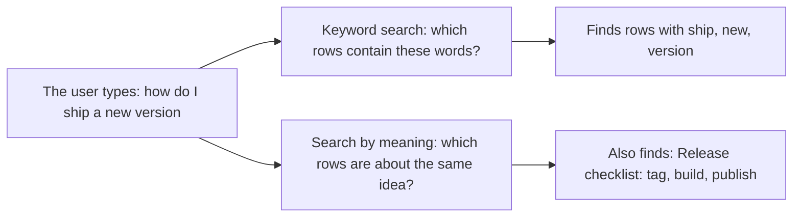
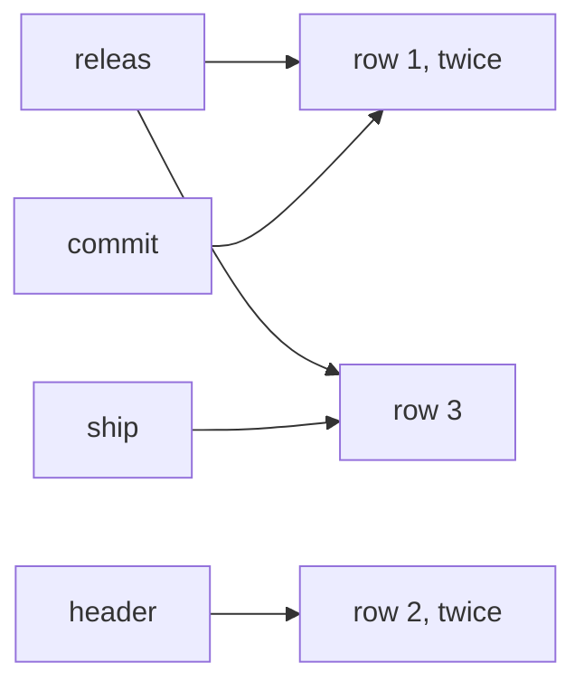
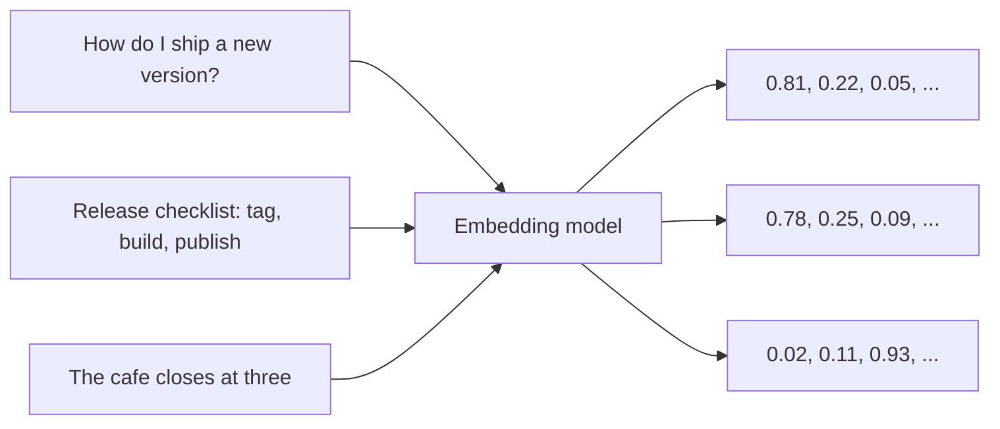
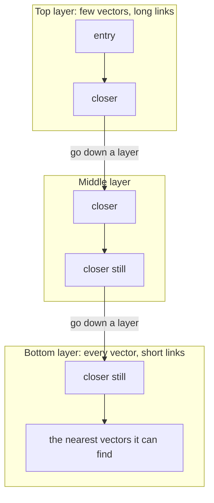
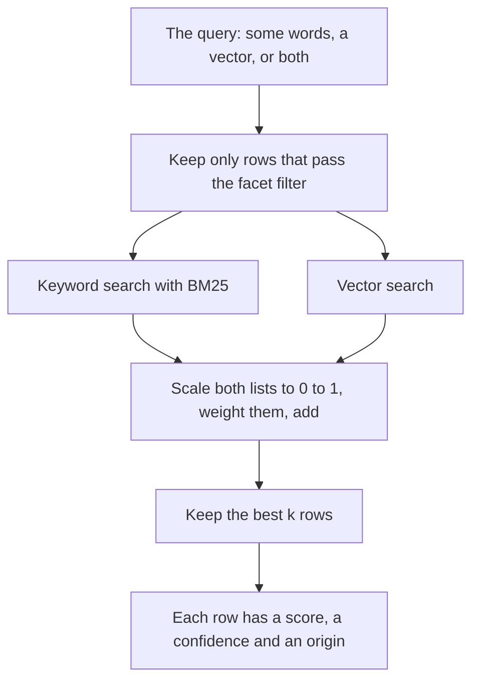
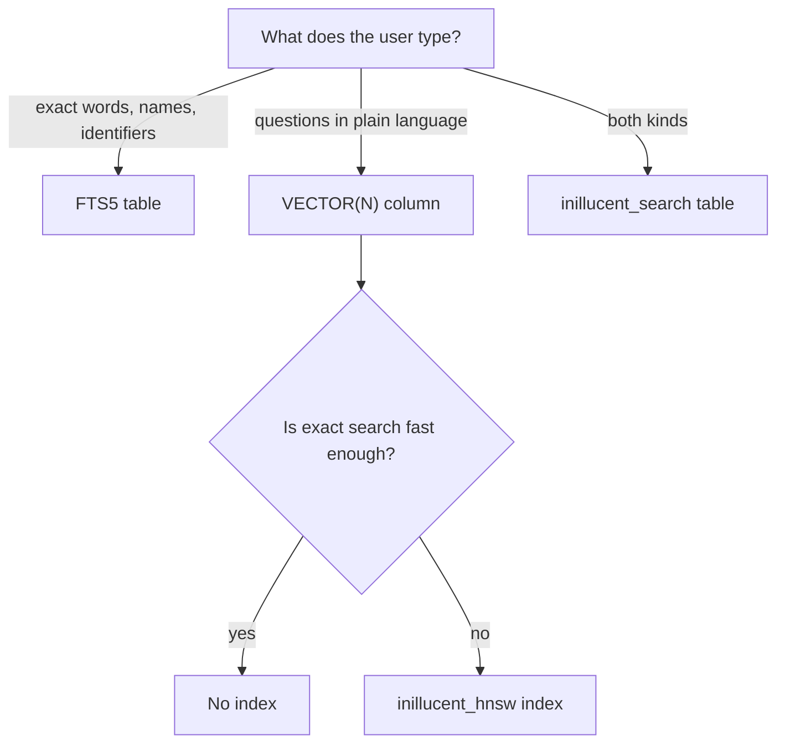

# Search explained from the start

This page explains how search works in inillucent for a reader who has never built a search
feature. It starts with what a search is, defines every term, and then builds one small database
step by step: keyword search first, then search by meaning, then the two together. Every query on
this page can be copied and run, and the output shown is what the build at `bc46bc9` (release
1.0.32) printed. A block of several statements runs in `inillucent-shell`, or with
`inillucent --db app.rdb batch "<statements>"`. A single `SELECT` runs with
`inillucent --db app.rdb query "<statement>"`.

You need to know what a table and a `SELECT` are. You do not need to know any mathematics beyond
adding and multiplying. When you have finished this page, [Vector search](vector-search.md) is the
reference for every option, and [How the retrieval engine works](architecture.md) has the details
of each step.

## Terms used on this page

Read this table once now and come back to it when a word is unfamiliar. Each term is explained
again, with an example, where the page first uses it.

| Term | Meaning |
|---|---|
| **query** | what the user is looking for: some words, a question, or a vector |
| **document** | one thing a search can return. In inillucent a document is one row |
| **hit** | a row that a search returned |
| **rank** | the order of the hits, best first |
| **keyword search** | finding rows that contain the words of the query. Also called lexical search or full text search |
| **token** | one word after the text has been split up. `Release notes` has two tokens |
| **tokenizer** | the code that splits text into tokens and cleans each one up |
| **stopword** | a word so common that the tokenizer drops it, such as `the` or `and` |
| **stemming** | cutting a word back to its root, so `releasing` and `released` both become `releas` |
| **inverted index** | a list from each token to the rows that contain it. It is what makes keyword search fast |
| **BM25** | the formula that gives each keyword hit a score. Rare words count for more than common ones |
| **FTS5** | SQLite's full text search table. inillucent answers the same SQL for it |
| **embedding** | a list of numbers that a trained model makes from a piece of text. Texts with similar meaning get similar lists |
| **vector** | a list of numbers. An embedding is a vector. In SQL a vector lives in a `VECTOR(N)` column |
| **dimension** | one position in a vector. A vector of 768 numbers has 768 dimensions |
| **search by meaning** | finding rows whose vectors are close to the query's vector. Also called vector search or semantic search |
| **cosine distance** | a number from 0 to 2 that says how far apart two vectors point. 0 means the same direction |
| **nearest neighbors** | the stored vectors with the smallest distance to the query vector |
| **exact search** | comparing the query vector with every stored vector. Always correct. Slower as the table grows |
| **approximate search** | comparing the query vector with only some stored vectors, found by walking a graph. Faster on a large table. Can miss a correct row |
| **HNSW** | the graph that approximate search walks. The name stands for Hierarchical Navigable Small World |
| **recall** | the share of the true nearest neighbors that a search returned. 1.0 means it found all of them |
| **hybrid search** | one search that uses keywords and vectors together and returns one ranked list |
| **score** | the number that decides the order of hybrid hits |
| **confidence** | a number from 0 to 1 that says how good a hit is on a scale that is the same for every query |
| **abstention** | returning no rows on purpose, because no row is good enough |
| **facet** | a column of a search table that a search can filter on while it runs |
| **`k`** | how many hits a search collects |
| **chunk** | a piece of a long document, about a paragraph, stored as its own row so a search can return just that piece |

## Two ways to find a row



**Keyword search** matches words. It is exact and predictable. A query for the ticket key
`PROJ-1932` or the function name `parse_headers` finds exactly the rows that contain it. Keyword
search cannot find a row that uses different words for the same idea. The query "ship a new version"
does not match the row "Release checklist: tag, build, publish", because the two share no words.

**Search by meaning** matches ideas. A model turns the query and every row into vectors, and the
search returns the rows whose vectors are closest to the query's vector. It finds the release
checklist for "ship a new version". It is weak at exact strings: a query for `PROJ-1932` can return
other tickets that are about similar things.

inillucent does both, in SQL, in the same file as your other tables. The rest of this page builds up
each one.

| You want | Use | Section |
|---|---|---|
| rows that contain some words | an FTS5 table | [Keyword search](#part-1-keyword-search) |
| rows that are about the same idea as a question | a `VECTOR(N)` column | [Search by meaning](#part-2-search-by-meaning) |
| search by meaning on a large table, fast | an `inillucent_hnsw` index on that column | [Making it fast](#part-3-making-search-by-meaning-fast) |
| one ranking that uses both | an `inillucent_search` table | [Hybrid search](#part-4-hybrid-search) |
| to return nothing when nothing matches | `confidence()` with a threshold | [When nothing matches](#part-6-when-nothing-matches) |

## Part 1: keyword search

### Step 1: text becomes tokens

A keyword search never compares the raw text. It first runs the text through a **tokenizer**, which
splits it into words and cleans each word up. The same tokenizer runs on the stored rows and on the
query, so both sides are cleaned the same way.

This is what the tokenizer of an `inillucent_search` table does to one sentence:

| Step | Result |
|---|---|
| the text | `Releasing the new App: tag, build, publish` |
| split on anything that is not a letter or a digit | `Releasing` `the` `new` `App` `tag` `build` `publish` |
| lowercase | `releasing` `the` `new` `app` `tag` `build` `publish` |
| drop stopwords | `releasing` `new` `app` `tag` `build` `publish` |
| stem each word | `releas` `new` `app` `tag` `build` `publish` |

Stemming is why a query for `released` finds a row that says `releasing`: both become `releas`.
Dropping stopwords is why `the` in a query does not match every row in the table.

**Identifiers are kept whole as well.** A word that holds a letter and a digit, an underscore, or
more than one separator is stored as itself and also split into its parts. So `PROJ-1932` is stored
as `proj-1932`, `proj` and `1932`, and `parse_headers` as `parse_headers`, `pars` and `header`. A
query for the whole identifier then matches it exactly. An email address is kept whole and is not
stemmed.

An FTS5 table has its own tokenizers, the ones SQLite's FTS5 has. The default, `unicode61`,
lowercases and splits but does not stem or drop stopwords. `fts5(title, body, tokenize = 'porter')`
adds stemming.

### Step 2: the inverted index

The tokens of every row go into an **inverted index**: a list from each token to the rows that
contain it.

Three rows:

| rowid | body |
|---|---|
| 1 | `Release process: tag the commit, then run the release script.` |
| 2 | `parse_headers reads the request headers.` |
| 3 | `The next release ships in May.` |

Part of their inverted index:



A search for `release` stems the query to `releas`, looks it up, and reads rows 1 and 3 from the
list. It never reads row 2. That is why keyword search stays fast on a large table: the work depends
on how many rows hold the word, and not on how many rows the table has.

### Step 3: BM25 gives each hit a score

Rows 1 and 3 both contain `release`. Which is the better hit? **BM25** answers that with a score
built from three ideas:

1. **A rare word counts for more than a common word.** If every row says `release`, finding
   `release` tells you little. If one row says `parse_headers`, finding it tells you a lot.
2. **Saying a word again helps, but less each time.** Row 1 says `release` twice. That counts for
   more than once, and less than twice as much.
3. **A long row does not win because it is long.** A long row holds more words by chance, so its
   count is scaled down by its length.

The first idea is a weight for each word. With N rows in the table and n rows that contain the word,
the weight is `ln(1 + (N - n + 0.5) / (n + 0.5))`. For our three rows:

| Word | Rows that contain it | Weight |
|---|---|---|
| `header` | 1 of 3 | ln(1 + 2.5 / 1.5) = **0.98** |
| `releas` | 2 of 3 | ln(1 + 1.5 / 2.5) = **0.47** |
| a word in all 3 rows | 3 of 3 | ln(1 + 0.5 / 3.5) = **0.13** |

`header` is in one row, so it weighs twice as much as `releas`, which is in two. A query that has
both words ranks the row with `header` higher, all else equal.

inillucent then adjusts the BM25 score of an `inillucent_search` table in three ways: a row that
holds more of the query's words ranks higher, a row where the words sit close together ranks higher,
and a row where they appear in the query's order ranks higher. [How the retrieval engine
works](architecture.md#scoring) has the numbers.

### Try it: an FTS5 table

```sql
CREATE VIRTUAL TABLE note USING fts5(title, body);

INSERT INTO note (title, body) VALUES
  ('Release process', 'Tag the commit, then run the release script.'),
  ('Parser notes',    'parse_headers reads the request headers.'),
  ('Lunch',           'The cafe closes at three.');

SELECT title, round(bm25(note), 3) AS score
FROM note
WHERE note MATCH 'release OR headers'
ORDER BY rank;
```

```
title            score
---------------  ------
Parser notes     -0.702
Release process  -0.656
```

- `note MATCH 'release OR headers'` is the keyword search. Two bare words with no `OR` would both
  have to be in the row.
- `bm25(note)` is the score. **In FTS5 a lower score is better**, and the numbers are negative.
  `ORDER BY rank` puts the best hit first.
- `Lunch` is not returned. It holds neither word.

The query language is FTS5's:

| You write | It matches |
|---|---|
| `release script` | rows with both words |
| `release OR headers` | rows with either word |
| `release NOT script` | rows with `release` and without `script` |
| `"run the release"` | the words next to each other, in this order |
| `rel*` | any word that starts with `rel` |
| `title: release` | `release` in the `title` column only |

`highlight()` marks where the words matched, which is what a search results page shows the user:

```sql
SELECT highlight(note, 1, '[', ']') AS body FROM note WHERE note MATCH 'release';
```

```
body
----------------------------------------------
Tag the commit, then run the [release] script.
```

## Part 2: search by meaning

### Step 1: text becomes a vector

An **embedding model** reads a piece of text and returns a list of numbers, a **vector**. The model
was trained so that texts with similar meaning get similar numbers. Nobody decides what each number
means. The model learned them from a large amount of text.



The first two vectors are close to each other because the texts are about the same thing. The third
is far from both. A real model returns hundreds of numbers: the model inillucent runs,
`nomic-embed-text-v1.5`, returns 768. This page uses vectors of three numbers so the examples fit on
the screen. The ideas are the same at 768.

You can make vectors in two ways:

- **Inside inillucent**, with the SQL function `embed(TEXT)`. It runs the model in your own
  process. Install the model once with `inillucent setup-embeddings all`. [Embeddings](embeddings.md)
  has the details.
- **Anywhere else**, with any model or service you like. Insert the numbers it returns.

### Step 2: distance says how close two vectors are

Picture each vector as an arrow from the centre of a space. Two texts about the same thing give
arrows that point the same way. **Cosine distance** measures the angle between two arrows:

| Cosine distance | The arrows | The texts |
|---|---|---|
| 0 | point the same way | about the same thing |
| 1 | at a right angle | unrelated |
| 2 | point opposite ways | rare with text models |

It is computed from the numbers. For `a = [1, 0, 0]` and `b = [0.9, 0.1, 0]`:

| Quantity | How | Value |
|---|---|---|
| dot product | 1 × 0.9 + 0 × 0.1 + 0 × 0 | 0.9 |
| length of `a` | √(1² + 0² + 0²) | 1 |
| length of `b` | √(0.9² + 0.1² + 0²) | 0.9055 |
| cosine similarity | 0.9 / (1 × 0.9055) | 0.9939 |
| cosine distance | 1 − 0.9939 | **0.0061** |

The two vectors point almost the same way, so their distance is close to 0. The engine does this
arithmetic for you:

```sql
SELECT round(vector_distance_cos('[1, 0, 0]', '[0.9, 0.1, 0]'), 4) AS close,
       round(vector_distance_cos('[1, 0, 0]', '[0, 0, 1]'), 4)     AS unrelated;
```

```
close   unrelated
------  ---------
0.0061  1.0
```

Cosine distance depends only on the direction of the two arrows. Their lengths do not change it.
inillucent also has
L2 distance, the straight line distance between the two tips, and the dot product.
[Vector search](vector-search.md#the-vector-functions) lists every vector function.

### Step 3: store vectors and find the nearest rows

```sql
CREATE TABLE passage (id INTEGER PRIMARY KEY, body TEXT, v VECTOR(3));

INSERT INTO passage (body, v) VALUES
  ('red apple',   '[1, 0, 0]'),
  ('green apple', '[0.9, 0.1, 0]'),
  ('blue sky',    '[0, 0, 1]'),
  ('grey cloud',  '[0, 0.2, 0.9]');

SELECT id, body, round(vector_distance_cos(v, '[1, 0, 0]'), 4) AS d
FROM passage
ORDER BY d
LIMIT 2;
```

```
id  body         d
--  -----------  ------
1   red apple    0.0
2   green apple  0.0061
```

- `VECTOR(3)` is a column that holds exactly three numbers. A vector of any other width is refused
  when you write it.
- A vector is written as a JSON array in quotes. A driver can also bind it as bytes.
- `ORDER BY` the distance with a `LIMIT` returns the **nearest neighbors**, the closest rows first.

This query compares the query vector with every row. That is an **exact search**. It always returns
the true nearest rows. The time it takes grows in step with the number of rows.

**The query vector must come from the same model as the stored vectors.** Numbers from two
different models do not mean the same thing, so their distances mean nothing. The same holds for
`nomic-embed-text-v1.5`'s two labels: write `embed('search_document: ' || body)` for stored text and
`embed('search_query: ' || ?1)` for the question, because the model was trained that way.

With the model installed, the whole search is one statement:

```sql
SELECT id, body
FROM passage768
ORDER BY vector_distance_cos(v, embed('search_query: ' || ?1))
LIMIT 5;
```

`passage768` stands for a table with a `VECTOR(768)` column filled with `embed()`. inillucent
computes the question's vector once for the whole statement.

## Part 3: making search by meaning fast

### Exact search compares everything

Exact search reads every stored vector and computes one distance for each. At a few thousand rows
that takes well under a millisecond. At hundreds of thousands of rows it takes several
milliseconds, and it keeps growing with the table.

### HNSW walks a graph instead

An **HNSW** index is a graph. Each vector is linked to a few of the vectors nearest to it. A search
starts at one vector and keeps moving to a linked vector that is closer to the query, until no
linked vector is closer.

The graph has layers. The top layer has few vectors, so each link spans a long distance. The bottom
layer has every vector, so each link is short. A search covers most of the distance on the top
layers and finishes on the bottom one:



The walk compares the query with a few hundred or a few thousand vectors. It does not look at the
rest. That is why it is fast, and it is also why it can miss: a true nearest neighbor that the walk
never reached is not returned. This is called **approximate search**.

### Recall measures what the walk missed

**Recall** is the share of the true nearest rows that a search returned. If exact search says the
best ten rows are A to J and the walk returned eight of them, recall is 0.8. Exact search always has
recall 1.0.

`ef_search` sets how many candidates the walk keeps. A larger `ef_search` finds more of the true
neighbors and takes longer. Measured on 185,078 chunks of real text at 768 dimensions, in the graded
run of 20 September 2026:

| `ef_search` | Recall of the top 10 | Time per search |
|---|---|---|
| 64, the default | 0.8775 | 0.61 ms |
| 128 | 0.9525 | 1.08 ms |
| 512 | 0.9875 | 3.27 ms |

[Vector search](vector-search.md#what-the-two-modes-cost) has the exact search times beside these.

### Try it: add an index

```sql
CREATE INDEX passage_v ON passage USING inillucent_hnsw (v);

EXPLAIN QUERY PLAN
SELECT id, body FROM passage ORDER BY vector_distance_cos(v, '[1, 0, 0]') LIMIT 2;
```

```
id  parent  notused  detail
--  ------  -------  -------------------------------------------------
0   0       0        SEARCH passage USING VECTOR INDEX passage_v (k=2)
1   0       0        USE TEMP B-TREE FOR ORDER BY
```

The query did not change. The planner saw `ORDER BY` a distance with a `LIMIT` and asked the index
for the nearest rows. `SEARCH ... USING VECTOR INDEX` in the plan shows that it did.

What to know about the index:

- **A new `inillucent_hnsw` index walks the graph.** To keep exact answers and still have the
  index, create it `WITH (mode = 'exact')`.
- **A small table is searched exactly anyway.** Below 2,048 rows with the default settings,
  comparing every vector costs less than walking the graph, and the index does that.
- **The index and the table commit together.** Every `INSERT`, `UPDATE` and `DELETE` updates the
  index in the same transaction.
- **The distance in the query must match the index.** A cosine index answers
  `vector_distance_cos`. `vector_distance_l2` needs an index created `WITH (metric = 'l2')`. With a
  mismatch the query still answers correctly, by comparing every row.

**Start with exact search.** It is correct by construction. Add an index, or switch it to
approximate mode, when you have measured a search that is too slow. Before you rely on approximate
mode, compare its answers with exact search on your own data.

## Part 4: hybrid search

### Why use both

A keyword search alone misses rows that use different words. A vector search alone ranks
`parse_headers` below passages about similar functions. **Hybrid search** runs both and combines
their two ranked lists into one, so one table can answer an exact identifier and a question in plain
language.

An `inillucent_search` table holds text and a vector for each row and does both searches in one
query:



### Try it: an `inillucent_search` table

```sql
CREATE VIRTUAL TABLE docs USING inillucent_search(title, body, region FACET, dims = 3);

INSERT INTO docs (rowid, title, body, region, vector) VALUES
  (1, 'Release process',  'Tag the commit, then run the release script.', 'eu', '[1, 0, 0]'),
  (2, 'Parser notes',     'parse_headers reads the request headers.',     'us', '[0, 1, 0]'),
  (3, 'Release calendar', 'The next release ships in May.',               'us', '[0.9, 0.1, 0]');
```

- `title` and `body` are text columns. Both are tokenized for the keyword search.
- `region FACET` is stored with the row for filtering. It is not searched as text.
- `dims = 3` gives each row a vector of three numbers, written to the hidden `vector` column.

Keyword only:

```sql
SELECT rowid, title FROM docs WHERE docs MATCH 'release' ORDER BY rank;
```

```
rowid  title
-----  ----------------
3      Release calendar
1      Release process
```

Vector only:

```sql
SELECT rowid, title FROM docs WHERE vector = '[1, 0, 0]' AND k = 2;
```

```
rowid  title
-----  ----------------
1      Release process
3      Release calendar
```

Both together:

```sql
SELECT rowid, title,
       round(score(docs), 3)      AS score,
       round(confidence(docs), 3) AS confidence,
       origin(docs)               AS origin
FROM docs
WHERE docs MATCH 'release' AND vector = '[1, 0, 0]' AND k = 3
ORDER BY rank;
```

```
rowid  title             score  confidence  origin
-----  ----------------  -----  ----------  ------
3      Release calendar  0.998  0.753       both
1      Release process   0.296  0.736       both
2      Parser notes      0.0    0.0         vector
```

The query names the search in its `WHERE` clause:

| You write | What it does |
|---|---|
| `docs MATCH 'text'` | the keyword part, in FTS5 query syntax |
| `vector = '[...]'` | the vector part |
| `k = 3` | how many hits to collect. The default is 10 |
| `ORDER BY rank` | best hit first |

And three functions describe each hit:

| Function | What it says |
|---|---|
| `score(docs)` | the combined number that decided the order. Higher is better |
| `confidence(docs)` | how good the hit is, from 0 to 1, on the same scale for every query |
| `origin(docs)` | which search found the row: `lexical` (keywords), `vector` or `both` |

### How the two lists become one

A BM25 score of 3.2 and a cosine similarity of 0.97 are on different scales, so they cannot be added
as they are. The engine does three things:

1. **Scale each list to 0 to 1.** The best hit in each list becomes 1 and the worst becomes 0.
2. **Choose a weight.** The vector list starts with a weight of 0.35 and the keyword list gets
   0.65. The engine moves the weight for each query, from 0.05 to 0.95. A query full of
   identifiers such as `parse_headers` moves it toward keywords.
3. **Add.** `score = weight × vector part + (1 − weight) × keyword part`. A row one list did not
   find gets 0 for that part.

The output of the query in [Try it](#try-it-an-inillucent_search-table) works out like this:

| Row | Keyword part | Vector part | Score |
|---|---|---|---|
| 3, `Release calendar` | 1, the best keyword hit. It is the shorter of the two rows that say `release` | 0.994, almost the best vector hit | **0.998** |
| 1, `Release process` | 0, the worse of the two keyword hits | 1, the best vector hit | **0.296** |
| 2, `Parser notes` | 0, no `release` in it | 0, the worst vector hit | **0** |

For this query the engine chose a vector weight of 0.296. Row 1's score is that weight times its
vector part of 1. Row 3's score is 0.296 × 0.994 + 0.704 × 1 = 0.998. Row 2 was found by the vector
search alone, so its `origin` is `vector`.

**`k` and `LIMIT` are different.** `k` decides how many hits the search collects before any other
part of the query runs. `LIMIT` trims the rows the query returns afterwards.

## Part 5: filtering a search

A search often needs a filter: only this customer's documents, only this region, only open tickets.
Declare the column you filter on as a `FACET` and put the filter in the same `WHERE` clause:

```sql
SELECT rowid, title FROM docs
WHERE docs MATCH 'release' AND region = 'us' AND k = 10
ORDER BY rank;
```

```
rowid  title
-----  ----------------
3      Release calendar
```

A facet filter is applied **inside** the search. The search only collects rows that pass it, so
asking for `k = 10` returns up to ten rows that all pass.

A filter on a column that is not a facet runs **after** the search has picked its `k` rows. If most
of those rows fail the filter, the query returns fewer rows than you asked for, and the ranking can
differ from the one a facet gives. Use a facet for any filter a search needs.

## Part 6: when nothing matches

A search always has a best hit, even when nothing in the table answers the question. The score does
not help here: step 1 above scales the best hit in each list to 1, however poor it is.

`confidence(docs)` is built for this. It divides each part by a fixed ceiling in place of the best
hit: a cosine similarity can never be above 1, and a BM25 score can never be above the score of a
row that holds every query word. So a confidence near 0 means nothing matched well, whatever the
query was.

To return nothing when nothing is good enough, keep only the rows above a threshold:

```sql
SELECT rowid, title, round(confidence(docs), 3) AS confidence
FROM docs
WHERE docs MATCH 'lunch menu' AND vector = '[0, 0, 1]' AND k = 3
  AND confidence(docs) >= 0.3
ORDER BY rank;
```

```
rowid  title  confidence
-----  -----  ----------
```

No row passes, so the query returns nothing. This is called **abstention**. An application, or an
AI agent, can then say "I do not know" instead of showing the best of a bad list.

The engine has no built in threshold, because a good threshold depends on your model and your data.
One way to choose it: run questions that do have an answer, take the confidence of the top hit of
each, and use a value just below the lowest of them. [Vector search](vector-search.md#confidence-is-a-separate-number-from-score)
has measured thresholds and one case where a threshold alone is not enough.

## Choosing what to build



| Question | Answer |
|---|---|
| I only have text and no model | FTS5. It needs nothing else |
| I have a model, and users ask questions | a `VECTOR(N)` column, then an `inillucent_hnsw` index when it gets slow |
| Users search for both names and ideas | an `inillucent_search` table |
| My search must be filtered by user or tenant | an `inillucent_search` table with a `FACET` column |
| My program must know when there is no good answer | an `inillucent_search` table and a threshold on `confidence()` |
| I am building a question answering agent over documents | split each document into chunks of about a paragraph, one row each, in an `inillucent_search` table. `examples/rag-agent` is a complete one |

## Common mistakes

| What happens | Why | What to do |
|---|---|---|
| an insert fails with `it is not a vector, and the column is declared VECTOR(3)` | the vector has the wrong number of numbers | make every vector exactly N numbers |
| the plan says `SCAN` where you expected `USING VECTOR INDEX` | the distance in `ORDER BY` does not match the index's metric, or there is no `LIMIT` | use `vector_distance_cos` with a cosine index, and add a `LIMIT` |
| a filtered search returns fewer rows than `k` | the filter column is not a `FACET`, so it ran after the search | declare the column `FACET` |
| search by meaning returns nonsense | the query and the rows were embedded by different models, or without the `search_query: ` and `search_document: ` labels | embed both sides with the same model and the right labels |
| every confidence is small | the query vector is not length 1, or the hits were found by keywords alone | pass a vector of length 1, with `l2_normalize(v)` if needed, and check `origin()` |
| an FTS5 query for `released` misses `release` | the default FTS5 tokenizer does not stem | create the table with `tokenize = 'porter'`, or use an `inillucent_search` table |
| the first search after opening the file is slow | an `inillucent_search` table reads its index into memory on the first search | run `INSERT INTO docs(docs) VALUES('compact')` after a large load |
| a statement fails with exit code 3 or the status `unsupported` | that construct is not built yet | rewording it will not help. Check `inillucent capabilities` |

## From the command line and from an agent

The command line has one command for each kind of search:

```sh
inillucent --db app.rdb search 'release' --table note --k 5
inillucent --db app.rdb vector-search passage --column v --vector '[1, 0, 0]' --k 2
```

Add `--output json` when a program reads the result. The MCP server offers the same two commands as
the tools `inillucent_search` and `inillucent_vector_search`, so an AI agent can search a database
without writing SQL.

## Where to go next

- [Vector search](vector-search.md): every option of `VECTOR(N)`, `inillucent_hnsw`, FTS5 and
  `inillucent_search`, with measured costs
- [Embeddings](embeddings.md): install the model and make vectors with `embed()`
- [How the retrieval engine works](architecture.md): the graph walk, the BM25 adjustments, the
  weight for each query and the confidence, step by step
- [Retrieval quality](retrieval-quality.md): how inillucent's search compares with PostgreSQL and
  pgvector on the same data
- [Glossary](glossary.md): every database and search term in one sentence
